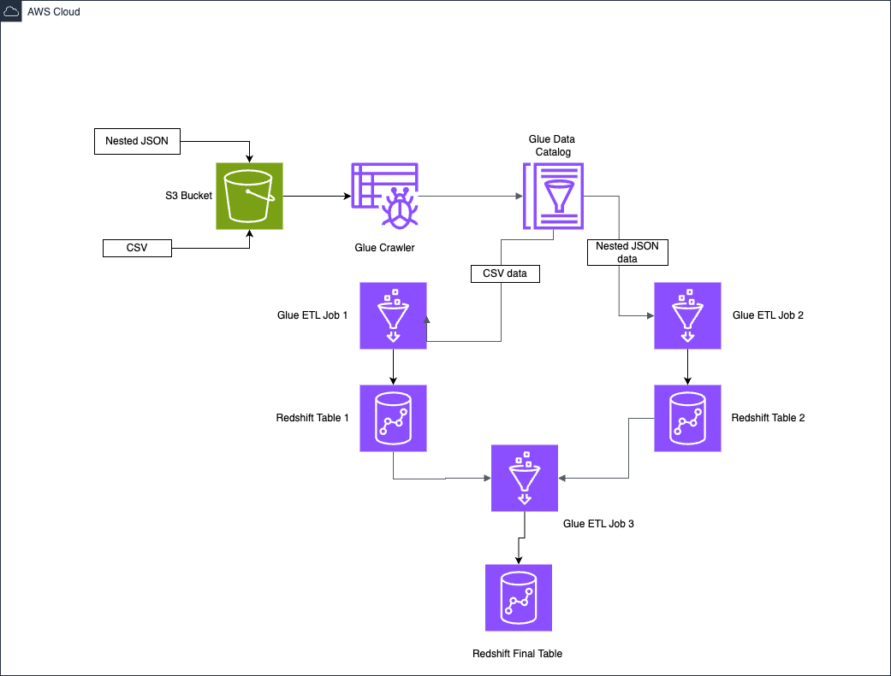

# AWS Data Pipeline

## Project Requirements and Objectives
  
The main objectives of this data pipeline project are:
- Parse a nested JSON file and load the data into a Redshift table
- Parse a CSV file and load the data into a Redshift table
- Join the data from the two Redshift tables and load the final result into a Redshift table
- Automate and orchestrate the pipeline using AWS services

The pipeline will utilize the following AWS services and technologies:
- Amazon S3 for storing the source data files and staging data
- AWS Glue Crawler for crawling the data files and creating a Data Catalog
- AWS Glue ETL jobs for data transformation using PySpark
- Amazon Redshift for the data warehouse
- AWS Lambda for custom processing logic
- Amazon EventBridge for event-driven orchestration
- AWS Glue Workflows for defining the pipeline flow

## Project Structure

- Create Crawler: CrawlerFetchFromS3
- Create 3 ETL JOBS:
  - GlueJobInsertCustomers
  - GlueJobInsertOrders
  - GlueJobInsertCustomerOrders

## Project Tasks
1. Create an S3 bucket and upload sample nested JSON and CSV files
2. Create a Redshift cluster and configure security groups and IAM roles
3. Create a Glue Crawler to crawl the S3 data and populate the Glue Data Catalog
4. Create a Glue ETL job to parse the nested JSON, flatten it, and load it into a Redshift table
5. Create a Glue ETL job to parse the CSV file and load it into a Redshift table
6. Create a Glue ETL job to join the two Redshift tables and load the result into a final table
7. Create an EventBridge rule to trigger a Lambda function when files are uploaded to S3
8. Create a Lambda function to start a Glue Workflow that runs the ETL jobs
9. Create a Glue Workflow to orchestrate the ETL jobs

## Architecture

